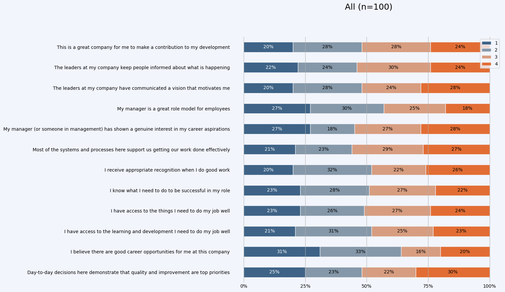

# Likert Graph CLI

A likert survey result graph generator.



## Install

To install globally, clone this repo and run

```
pip install .
```

## Usage

```
Usage: likert-graph-cli [OPTIONS] INPUT OUTPUT

  Generates a horizonal bar graph based on likert scores (agree, disagree,
  etc...).

  INPUT expects a csv file of scores, one response per row with each
  question as a column. OUTPUT is the filename for the generated graph
  (png). If multiple graphs will be created (via cohorts), a number will be
  appended to the filename, e.g. output.1.png.

Options:
  -c, --cohort-column TEXT  Name of the column to group cohorts by. Will
                            output multiple graphs.

  -g, --has-groups          Expect INPUT to have first header row of column
                            groups.

  -n, --numeric-only        Filter columns to those that have numeric values
                            only

  -s, --sample              Generate a sample csv file of random data and
                            exit.

  -v, --values TEXT         Comma-separated list of value names in order from
                            positive to negative.

  -h, --help                Show this message and exit.
```

## Development

A Makefile is available to script setup and development usage. Uses a python virtual environment at `.venv`.

Install with

```
make init
````

Run linting with

```
make lint
```

Run tests and linting with 

```
make test
```

## Samples

Sample data 4 scale numeric based values.

```
likert-graph-cli -n sample/basic.csv likert_graph.png
```

Sample data with cohorts.

```
likert-graph-cli -n -c "Team" sample/cohorts.csv likert_graph.png
```

Sample data with question groups and cohorts.

```
likert-graph-cli -n -g -c "Team" sample/groups_cohorts.csv likert_graph.png
```

Sample data with question groups, cohorts and using text based values.

```
likert-graph-cli -g -c "Team" -v "strongly agree, agree, neutral, disagree, strongly disagree" sample/text_values.csv likert_graph.png
```

## Todo
- Option to sort the question groups
- Option to flip the order of values, e.g. from disagreeable to agreeable
